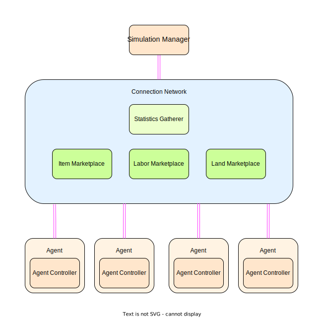

# Program Architecture

## Agent
All economic participants in the simulation are instances of the **Agent** class.
The Agent class is a generic class used by all agents running in a simulation. 

The behavior and actions of any given agent is decided by it's controller, which handles all decision making. 
The Agent class is instead responsible for the controller's interface to the rest of the simulation, as well as keeping track of the agent's current state.

## Conection Network
The **Connection Network** is how all agents in the simulation communicate with each other. 
Each agent has a single bidirectional connection with the connection network (this is a [multiprocessing pipe](https://docs.python.org/3/library/multiprocessing.html#pipes-and-queues)). 
Agents send and receive [NetworkPackets](NetworkPackets.md) via this connection, which the Connection Network routes to the destination.

For performance reasons, the Connection Network is also where the statics gatherer and all marketplaces are instantiated.
* **Statistics Gatherer** - Snoops on network traffic and sends info requests to agents, in order to keep track of economic statistics.
* **Item Marketplace** - Acts a billboard where sellers can post listings for items that they're selling.
* **Labor Marketplace** - Acts a billboard where employers can post job listings.
* **Land Marketplace** - Acts a billboard where sellers can post listings for land they're selling.

## Simulation Manager
This agent is responsible for:
* Launching/stopping simulations
* Loading/saving simulation checkpoints
* Maintaining time synchronization between agents
### Time synchronization
Simulation time is divided into two units, **steps** and **ticks**.

A step can be thought of as a day. The start of each step is synched between agents; no agent can advance to the next step until all blocking agents are ready to do so. When all blocking agents are ready, the simulation manager will send out a broadcast to begin the next step.

A tick can be thought of as an hour. At the beginning of each step, all agents receive a fixed number of ticks. Ticks can be used to work at a job, produce items, eat a meal, etc. When an agent has used all it's ticks, it will notify the simulation manager, then wait for the next simulation step.
Tick usage is **asynchronous** across agents.